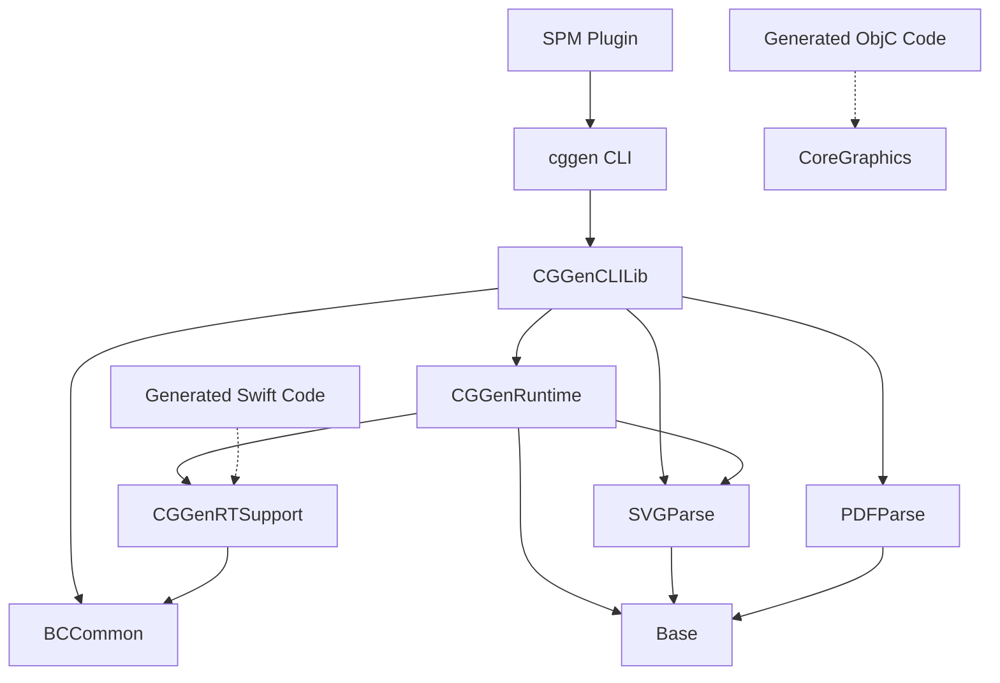

# cggen Architecture

```
┌─────────────────────────────────────────────────────────────────────────────┐
│                                  cggen Tool                                 │
├─────────────────────────────────────────────────────────────────────────────┤
│                                                                             │
│  ┌──────────┐     ┌─────────────┐     ┌─────────────┐     ┌──────────────┐  │
│  │ SVG/PDF  │ ──> │    cggen    │ ──> │ Code        │ ──> │ iOS/macOS    │  │
│  │ Files    │     │ (CLI Tool)  │     │ Generation  │     │ Application  │  │
│  └──────────┘     └─────────────┘     └─────────────┘     └──────────────┘  │
│                           │                    │                            │
│                           │                    ├── Swift + Bytecode         │
│                           │                    └── Objective-C              │
│                           │                                                 │
│                    ┌──────┴──────┐                                          │
│                    │ CGGenCLILib │                                          │
│                    └──────┬──────┘                                          │
│                           │                                                 │
│        ┌──────────────────┼──────────────────┐                              │
│        │                  │                  │                              │
│  ┌─────┴─────┐      ┌─────┴──────┐     ┌─────┴─────┐                        │
│  │ SVGParse  │      │ PDFParse   │     │ CGGenRuntime                       │
│  └───────────┘      └────────────┘     └─────┬─────┘                        │
│                                              │                              │
│                                        ┌─────┴──────┐                       │
│                                        │CGGenRTSupport                       │
│                                        └────────────┘                       │
└─────────────────────────────────────────────────────────────────────────────┘
```

This document describes the architecture and module structure of cggen, a tool for converting SVG and PDF files into optimized Core Graphics code.

## Related Documentation
- [API Usage Guide](api-usage-guide.md) - Practical examples for using cggen
- [API Design Considerations](api-design-considerations.md) - Design decisions and rationale
- [Adding New Attributes](adding-new-attribute.md) - Contributing SVG attribute support
- [Path Generation](path-generation.md) - Path extraction feature architecture

## Overview

cggen converts vector graphics (SVG/PDF) into either:
- Objective-C code that draws using Core Graphics
- Swift code with compressed bytecode for efficient runtime rendering

## Module Structure

### Core Modules

#### `cggen` (Executable Target)
The command-line interface entry point.
- Location: `Sources/cggen/`
- Dependencies: `CGGenCLILib`, `ArgumentParser`
- Purpose: Parses command-line arguments and invokes the CLI library

#### `CGGenCLILib`
The main library implementing all CLI functionality.
- Location: `Sources/CGGenCLILib/`
- Dependencies: `CGGenRuntime`, `SVGParse`, `PDFParse`, `BCCommon`
- Key Components:
  - `Entry.swift` - Main entry point with `runCggen()` function
  - `MBCCGGenerator.swift` - Generates Objective-C implementation files
  - `ObjcHeaderCGGenerator.swift` - Generates Objective-C header files
  - `SwiftCGGenerator.swift` - Generates Swift code with bytecode
  - `PDFToDrawRouteConverter.swift` - Converts PDF to intermediate representation

#### `CGGenRuntime`
Runtime library for parsing and rendering SVG/PDF files directly.
- Location: `Sources/CGGenRuntime/`
- Dependencies: `CGGenRTSupport`, `SVGParse`, `Base`
- Key Components:
  - `SVGToDrawRouteConverter.swift` - Converts SVG to DrawRoute
  - `SVGRenderer.swift` - Direct SVG to CGImage rendering
  - `DrawStep.swift`, `PathSegment.swift` - Intermediate representation
  - `BytecodeGeneration.swift` - Converts DrawRoute to bytecode
- Use Case: Runtime SVG/PDF rendering without code generation

#### `CGGenRTSupport`
Bytecode execution library for generated code.
- Location: `Sources/CGGenRTSupport/`
- Dependencies: `BCCommon`
- Key Components:
  - `Drawing.swift` - Main type used by generated Swift code
  - `BytecodeRunner.swift` - Executes bytecode on CGContext
  - `PlatformImageSupport.swift` - UIImage/NSImage creation
  - `DrawingContentMode.swift` - Scaling and positioning
- Use Case: Required by apps using cggen-generated Swift code

### Parser Modules

#### `SVGParse`
SVG parsing using swift-parsing library.
- Location: `Sources/SVGParse/`
- Dependencies: `Base`, `swift-parsing`
- Key Components:
  - `SVGParsing.swift` - Main SVG parser
  - `SVGValueParser.swift` - Attribute value parsers
  - `SVGShapeParser.swift` - Shape element parsers
  - `SVGFilterPrimitiveParser.swift` - Filter parsing

#### `PDFParse`
PDF content stream parsing.
- Location: `Sources/PDFParse/`
- Dependencies: `Base`
- Key Components:
  - `PDFParser.swift` - Main PDF parser
  - `PDFContentStreamParser.swift` - Content stream parsing
  - `PDFOperator.swift` - PDF operator definitions

### Foundation Modules

#### `Base`
Common utilities and parser infrastructure.
- Location: `Sources/Base/`
- Dependencies: `swift-parsing`
- Key Components:
  - `Parser.swift` - Parser protocol and operators
  - `Color.swift` - Color representations
  - `Logger.swift` - Logging utilities
  - `XML.swift` - XML parsing utilities

#### `BCCommon`
Bytecode common definitions.
- Location: `Sources/BCCommon/`
- Dependencies: None
- Key Components:
  - `Command.swift` - Bytecode command definitions
  - `Commons.swift` - Common bytecode types

## Module Dependencies



## Usage Patterns

### 1. Command-Line Code Generation

```bash
# Generate Objective-C
cggen icon.svg --objc-header Icon.h --objc-impl Icon.m

# Generate Swift with bytecode
cggen icon.svg logo.pdf --swift-output Icons.swift
```

### 2. SPM Plugin Integration

```swift
// Package.swift
.executableTarget(
    name: "MyApp",
    dependencies: ["CGGenRTSupport"],
    plugins: ["cggen-spm-plugin"]
)
```

The plugin automatically:
1. Finds SVG/PDF files in your target
2. Runs cggen to generate Swift code
3. Includes generated code in compilation

### 3. Runtime SVG Rendering

```swift
import CGGenRuntime

// Parse and render SVG at runtime
let svgData = Data(contentsOf: svgURL)
let image = try SVGRenderer.renderSVGData(svgData, size: CGSize(width: 100, height: 100))
```

### 4. Using Generated Code

```swift
import CGGenRTSupport

// Swift code generated by cggen extends Drawing
Drawing.logo
    .image(scale: 2.0)  // Creates UIImage/NSImage
    
// SwiftUI usage
Drawing.icon
    .foregroundColor(.blue)
    .frame(width: 44, height: 44)
```

## Build-Time vs Runtime

### Build-Time (Code Generation)
- **Modules**: `cggen`, `CGGenCLILib`
- **When**: During build process
- **Output**: Swift/ObjC source files
- **Advantages**: 
  - No parsing overhead at runtime
  - Smaller binary size (only includes used graphics)
  - Compile-time optimization

### Runtime Rendering
- **Modules**: `CGGenRuntime`
- **When**: During app execution
- **Output**: CGImage/UIImage/NSImage
- **Advantages**:
  - Dynamic SVG loading
  - No code generation step
  - Useful for user-provided SVGs

### Runtime Execution (Generated Code)
- **Modules**: `CGGenRTSupport`
- **When**: During app execution
- **Input**: Bytecode from generated Swift files
- **Advantages**:
  - Extremely fast rendering
  - Minimal memory footprint
  - Type-safe API

## Key Design Decisions

1. **Intermediate Representation**: Both SVG and PDF are converted to a common `DrawRoute` format before code generation.

2. **Bytecode for Swift**: Swift code uses compressed bytecode instead of direct Core Graphics calls for smaller code size.

3. **Direct Calls for ObjC**: Objective-C code uses direct Core Graphics calls for simplicity and debugging.

4. **Modular Parsers**: Separate parsing libraries allow independent testing and reuse.

5. **SPM Plugin**: Automatic code generation integrates seamlessly with Swift Package Manager.